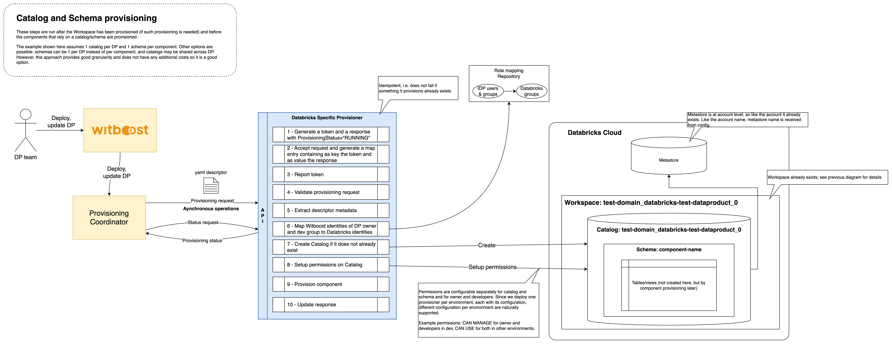
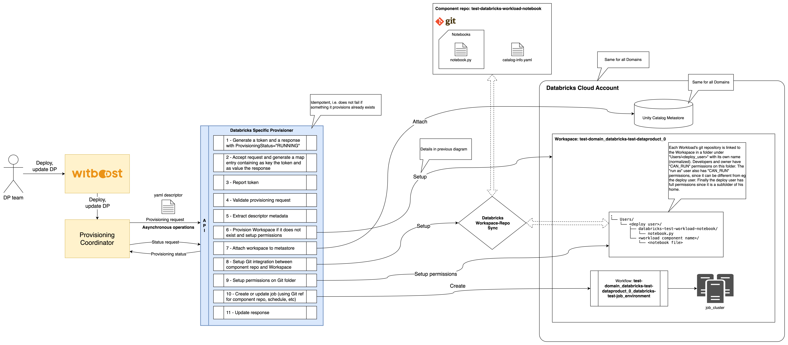
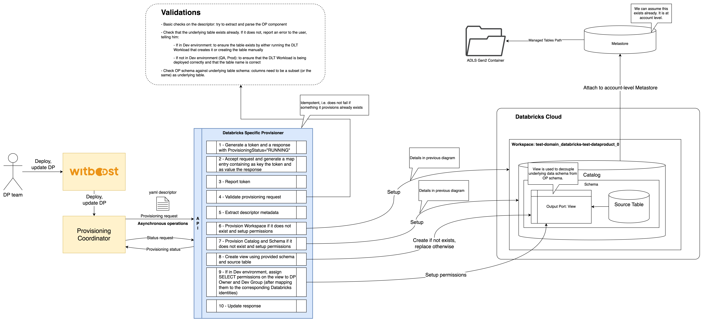
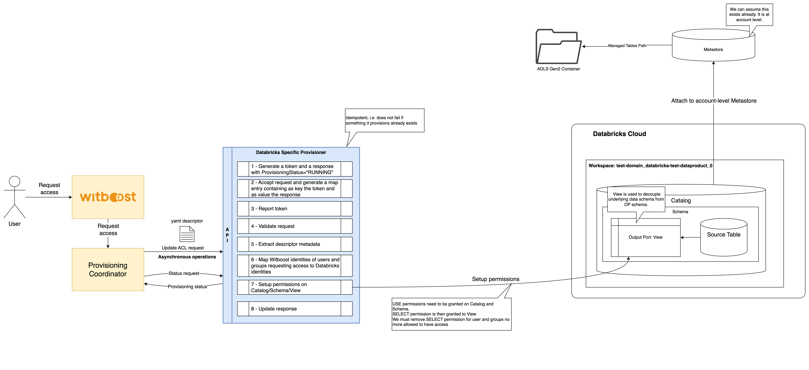

# High Level Design

This document describes the High Level Design of the Databricks Specific Provisioner.
The source diagrams can be found and edited in the [accompanying draw.io file](hld.drawio).

- [Overview](#overview)
- [Workflow](#workflow)
- [Provisioning](#provisioning)
  - [Workspace Provisioning](#workspace-provisioning)
  - [Catalog and Schema Provisioning](#catalog-and-schema-provisioning)
  - [Job Provisioning](#job-provisioning)
  - [Workflow Provisioning](#workflow-provisioning)
  - [Delta Live Tables (DLT) Pipeline Provisioning](#Delta-Live-Tables-DLT-Pipeline-Provisioning)
  - [Output Port Provisioning](#output-port-provisioning)
- [Unprovisioning](#unprovisioning)
  - [Job Unprovisioning](#job-unprovisioning)
  - [Workflow Unprovisioning](#workflow-unprovisioning)
  - [DLT Pipeline Unprovisioning](#DLT-Pipeline-Unprovisioning)
  - [Output Port Unprovisioning](#Output-Port-Unprovisioning)
- [Update Acl](#update-acl)
- [Reverse Provisioning](#reverse-provisioning)
  - [Workflow Reverse Provisioning](#workflow-reverse-provisioning)
  - [Output Port Reverse Provisioning](#output-port-reverse-provisioning)

## Overview

### Specific Provisioner

A Specific Provisioner (SP) is a service in charge of performing a resource allocation task, usually
through a Cloud Provider. The resources to allocate are typically referred to as the _Component_, the
details of which are described in a YAML file, known as _Component Descriptor_.

The SP is invoked by an upstream service of the Witboost platform, namely the Coordinator, which is in charge of orchestrating the creation
of a complex infrastructure by coordinating several SPs in a single workflow. The SP receives
the _Data Product Descriptor_ as input with all the components (because it might need more context) plus the id of the component to provision, named _componentIdToProvision_

To enable the above orchestration a SP exposes an API made up of five main operations:
- validate: checks if the provided component descriptor is valid and reports any errors
- provision: allocates resources based on the previously validated descriptor; clients either receive an immediate response (synchronous) or a token to monitor the provisioning process (asynchronous)
- status: for asynchronous provisioning, provides the current status of a provisioning request using the provided token
- unprovision: destroys the resources previously allocated.
- updateacl: grants access to a specific component/resource to a list of users/groups

### Databricks Specific Provisioner

This Specific Provisioner is an asynchronous provisioner that interacts with a Databricks Cloud account and provisions various kinds of components based on it. The components are:
- Workload based on a Databricks Job: used to process data using jobs powered by notebooks
- Workload based on a Databricks Delta Live Tables Pipeline: used to process data using pipelines powered by notebooks
- Output Port based on Unity Catalog View: used to expose data

It also takes care of setting up resources on Databricks such as the Workspace in which the other components live.

It mainly supports Databricks on Azure, with support for other cloud providers in the works.

In this provisioner **the provisioning and unprovisioning operations are asynchronous**: it means that they will return immediately a token that can be used sending GET requests to the `/v1/provision/{token}/status` endpoint (same for both) to obtain information about the result of the operation.

## Workflow

The lifecycle of a Databricks Workload (job or Delta Live Tables pipeline) follows the typical development flow used when developing on Databricks using git repository integration.

The user first creates a component using the Template in Witboost, which creates a component repository with example code. The user then deploys the component, which creates resources on Databricks. The user can then work as he normally would, editing the code and committing back to the git repo.

## Provisioning

The provisioning task creates (if not existent) the Workspace on Databricks based on the received parameters, it then creates the components inside of it.

The provisioner uses a configurable `deploy user` (on Azure, a service principal) to interact with the Databricks account.

### Workspace Provisioning

Workspace provisioning takes care of creating the Workspace and applying permissions to it. The Workspace is named based on the system that contains the components (eg, a Data Product); it is created as follows: `$Domain_$DPName_$MajorVersion`.

The permissions that are applied involve the Owner of the system and the associated Developer Group. On Azure environments, they are granted a configurable role that can act on the Workspace resource. Typically, such role has the "CAN_MANAGE" permission level.

If the Workspace already exists, only alignment operations are performed, like users, groups and permissions alignment. Workspace creation and management can be disabled if the user provides a URL for an existing workspace rather than a name to be used on creation.

### Catalog and Schema Provisioning

Catalog and Schema Provisioning happens after the Workspace has been provisioned (if such provisioning is needed) and before the components that rely on a catalog/schema are provisioned.

The example shown here assumes 1 catalog per DP and 1 schema per component. Other options are possible: schemas can be 1 per DP instead of per component, and catalogs may be shared across DP. However, this approach provides good granularity and does not have any additional costs, so it is a good option.

The main operations executed are:
- Mapping of Witboost identities of Data Product Owner and Development Group to the respective Databricks identities
- The creation of the Catalog if it doesn't exist
- The creation of the Schema if it doesn't exist
- Permission setup on Catalog and Schema: those permissions need to be **configurable separately for catalog and schema and for owner and developers**. Since we deploy one provisioner per environment, each with its configuration, different configuration per environment are naturally supported.

### Job Provisioning

After the Workspace has been provisioned, if a Workload of type Job is to be provisioned, the provisioner proceeds to set up the needed resources, mainly the integration between the component repository and the Databricks Workspace, and the Job that will run the code defined in the Workload.

#### Job Deployment

In the provisioning phase of the Workload a Job is created inside the Databricks Workspace based on the configuration set by the user (entry point, run as user, scheduling, compute resources, etc).

The Job is configured to point to a specific branch (typical for development environments) or tag (typical for QA/production) of the git repository. The job is named as follows: `$Domain_$DPName_$MajorVersion_$ComponentName_$Environment`

Each Workload's git repository is linked to the Workspace in a folder under `/Workspace/<dp_name>_<dp_major_version>/<component_name>` with its own name (normalized). Developer and owner have configurable permissions on this folder. Finally, the `deploy user` has full permissions since is the owner of the folder.

### Workflow Provisioning

After the Workspace has been provisioned, if a Workload of type workflow is to be provisioned, the provisioner proceeds to set up the needed resources: the integration between the component repository and the Databricks Workspace and the workflow that will run the code defined in the Workload.

#### Workflow Validation

Before proceeding with the workflow deployment, the request is validated according to the diagram shown in the diagram below. During this phase, it is checked that no workflow is unintentionally overwritten. The request will also contain an `override` field, which is automatically set to `false` after each reverse provisioning operation and is used to enable or disable overwriting.

#### Workflow Deployment

In the provisioning phase of the Workload a workflow is created inside the Databricks Workspace based on the configuration set by the user (entry point, run as user, scheduling, compute resources, etc).

The workflow is named as follows: `$Domain_$DPName_$MajorVersion_$ComponentName_$Environment`

Each Workload's git repository is linked to the Workspace in a folder under `/Workspace/<dp_name>_<dp_major_version>/<component_name>` with its own name (normalized). Developer and owner have configurable permissions on this folder. Finally, the `deploy user` has full permissions since is the owner of the folder.

### Delta Live Tables (DLT) Pipeline Provisioning

After the Workspace has been provisioned, if a Workload of type DLT Pipeline is to be provisioned, the provisioner proceeds to set up the needed resources, mainly the integration between the component repository and the Databricks Workspace, and the DLT Pipeline that will run the code defined in the Workload.

#### DLT Pipeline Deployment

In the provisioning phase of the Workload a DLT Pipeline is created inside the Databricks Workspace based on the configuration set by the user (workspace, unity catalog, entry point, compute resources, etc).

The DLT Pipeline is configured to point to a notebook contained in a specific branch (typical for development environments) or tag (typical for QA/production) of the git repository. The pipeline is named as follows: `$Domain_$DPName_$MajorVersion_$ComponentName_$Environment`

Each Workload's git repository is linked to the Workspace in a folder under `/Workspace/<dp_name>_<dp_major_version>/<component_name>` with its own name (normalized). Developer and owner have configuarble permissions on this folder.  Finally, the `deploy user` has full permissions since is the owner of the folder.

### Output Port Provisioning

A view is used to decouple underlying source table schema from the Output Port schema.

The main operations executed are:
- Validation:
  - the underlying source table must already exist. We can differentiate the error message based on the environment we're actually deploying on:
    - If in Dev environment: to ensure the table exists by either running the DLT Workload that creates it or creating the table manually
    - If not in Dev environment (QA, Prod): to ensure that the DLT Workload is being deployed correctly and that the table name is correct
  - Check OP schema against underlying table schema: columns need to be a subset (or the same) as underlying table.
- Provision [Workspace](#workspace-provisioning), [Catalog, Schema](#catalog-and-schema-provisioning) if they do not exist and setup related permissions
- View creation using provided schema and source table. If in Dev environment, assign `SELECT` permissions on the view to `DP Owner` and `Dev Group` (after mapping them to the corresponding Databricks identities)

#### Schema
Since a schema is always needed for the OPs, we need one when deploying. We can let the user create the OP without schema. We can also give him the following options:
- let user inherit schema from another component
- let user edit schema via edit wizard
- let user edit schema using reverse provisioning from eg a DLT

## Unprovisioning

Unprovisioning consists of removing the existing resources associated to the components. The Workspace itself is never deleted, as other components may still rely on it and even if no other components exist, the users may have personal notebooks or such resources in their folders, and we prefer to avoid their accidental deletion. In case the system to which the Workspace is to be completely erased, manual deletion is required for now. The provisioner can easily be extended to do this in case automated deletion is preferred.

### Job Unprovisioning

When a Workload component of Job type is unprovisioned, the provisioner proceeds to do the following:

- Remove any Jobs associated to the component

- If `removeData` for the component is set to true in the request then remove the repo from the Workspace

The operation is idempotent, and does not fail if the resources it tries to remove are missing.

### Workflow Unprovisioning

When a Workload component of workflow type is unprovisioned, the provisioner proceeds to do the following:

- Remove any workflow associated to the component

- If `removeData` for the component is set to true in the request then remove the repo from the Workspace

The operation is idempotent, and does not fail if the resources it tries to remove are missing.

### DLT Pipeline Unprovisioning

When a Workload component of DLT Pipeline type is unprovisioned, the provisioner proceeds to do the following:

- Remove any DLT Pipeline associated to the component

- If `removeData` for the component is set to true in the request then remove the repo from the Workspace

The operation is idempotent, and does not fail if the resources it tries to remove are missing.

### Output Port Unprovisioning

Unprovisioning consists of dropping the View from the catalog.

The operation is idempotent, and does not fail if the resources it tries to remove are missing.

## Update Acl

This operation is only available for the Output Port component. Three main operations are executed on this phase:
1. Request validation
2. Map of the Witboost identities requesting access to Databricks identities
3. Grant proper permissions to mapped users and groups:
   - `USE` permission to Catalog and Schema
   - `SELECT` permission to View
   > We must remove `SELECT` permission for user and groups no more allowed to have access

## Reverse Provisioning

In a standard provisioning workflow, users on Witboost define and update the components and their metadata by working on the `catalog-info.yaml` file in the component's git repository. Specific Provisioners receive instructions to align the target infrastructure based on the content of that file.

However, often developers and data engineers prefer to directly interact with the target infrastructure service. Say you have a table on Databricks and a Witboost component that references it: with the reverse provisioning feature, if you want to update the table schema, you can directly update the Databricks table. Once you are ready, you can just trigger a reverse provisioning operation on the Witboost component to automatically reflect the new changes into the `catalog-info.yaml`.

The Specific Provisioner receives a [Reverse Provision request](https://docs.witboost.com/docs/p3_tech/p3_customizations/p3_7_reverse_provisioning/p3_7_3_specific_provisioner_setup) that contains in the `params` object (coming from the Reverse Provisioning Wizard and defined in the [Reverse Provisioning Template](https://docs.witboost.com/docs/p3_tech/p3_customizations/p3_7_reverse_provisioning/p3_7_2_template)) the information needed to execute the operation.

The field `useCaseTemplateId` of the request can be checked to see if the specific template is compatible with the Provisioner itself, but also to support different reverse provision operations for different kind of components.

### Workflow Reverse Provisioning

In this specific case, the `params` field is not needed.

The Provisioner execute a validation step to make sure the request is valid and all the required fields are present. Then it checks for the existence of the workflow.

If the validation succeeds, the workflow details are retrieved from Databricks and added to the `specific.workflow` section of the `catalog-info.yaml` file associated with the component, which is then updated accordingly.

### Output Port Reverse Provisioning

In the specific case, the `params` object consist of:
- catalog name of the source table/view
- schema name of the source table/view
- name of the source table/view.
- flag to choose between:
  - schema inheritance only
  - schema inheritance and table details (catalog, schema, name of the table used as source for the output port)

The Provisioner executes a validation step to make sure the request is valid and all the required fields are present. Then it checks for the existence of the source table/view. If the user chose to also inherit table details, we must also ensure that the params received correspond to a **table** and not to a view.

If the validation succeeds, the schema information is retrieved from the source table/view. The data must include, for all columns:
- name
- data type (along with details like length, precision, scale when applicable)
- constraints

The returned schema must be converted to be compatible with [open-metadata](https://docs.open-metadata.org/latest/main-concepts/metadata-standard/schemas/entity/data/table) specification: the `dataContract.schema` section of the `catalog-info.yaml` file will be updated.
Additionally, if the user chose to inherit also table details, those details are returned to make sure that the source table used for the reverse provisioning is the same defined in the Output Port: specifically, the reverse provisioning information will update the keys (`catalogName`, `schemaName`, `tableName`) of the table used as source of the output port.

